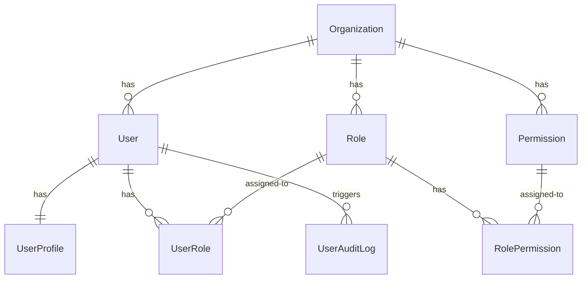

# Multi-Org Multi-User RBAC — Implementation Flow

## Overview

This document defines the production implementation plan for tenant-isolated multi-organization user management with role-based access control. The flow is split into two distinct paths: **new organization onboarding** (signup) and **subsequent user creation** (admin/distributor).

---

## Path 1: New Organization Onboarding (`POST /api/auth/signup`)

When a new company registers, a full tenant must be bootstrapped with all roles and permissions.

### Request

```json
{
  "organizationCode": "acme-corp",
  "organizationName": "Acme Corp Pvt Ltd",
  "email": "admin@acme.com",
  "fullName": "John Doe",
  "password": "securePassword123"
}
```

### Implementation — Service Method

```ts
async signup(dto: SignupDto) {
  // 1. Create Organization
  const organization = await this.prisma.organization.create({
    data: { code: dto.organizationCode, name: dto.organizationName },
  });

  // 2. Seed standard permissions for this org
  const permissionRecords = await this.seedPermissions(organization.id);

  // 3. Seed standard roles with permission mappings
  const roleRecords = await this.seedRoles(organization.id, permissionRecords);

  // 4. Create user
  const passwordHash = await bcrypt.hash(dto.password, 12);
  const [firstName, ...rest] = dto.fullName.trim().split(' ');
  const lastName = rest.join(' ') || '-';
  const user = await this.prisma.user.create({
    data: {
      organizationId: organization.id,
      email: dto.email,
      passwordHash,
      status: 'ACTIVE',
      createdBy: null, // self-signup
      profile: {
        create: { firstName, lastName, fullName: dto.fullName },
      },
      roles: {
        create: {
          roleId: roleRecords.find((r) => r.name === 'Admin')!.id,
          createdBy: null,
        },
      },
    },
    include: { profile: true, roles: { include: { role: true } } },
  });

  // 5. Audit log
  await this.auditLog.create({
    organizationId: organization.id,
    actorId: user.id,
    action: 'ORGANIZATION_CREATED',
    entityType: 'organization',
    entityId: organization.id,
    newValue: { code: organization.code, name: organization.name },
  });
  await this.auditLog.create({
    organizationId: organization.id,
    actorId: user.id,
    action: 'USER_CREATED',
    entityType: 'user',
    entityId: user.id,
    newValue: { email: user.email, role: 'Admin' },
  });

  return { id: user.id, email: user.email, fullName: user.profile!.fullName, organizationId: user.organizationId };
}
```

### Helper Methods

```ts
private async seedPermissions(organizationId: string) {
  const permissionDefs = [
    { code: 'users.read', name: 'View Users' },
    { code: 'users.create', name: 'Create Users' },
    { code: 'users.update', name: 'Edit Users' },
    { code: 'users.delete', name: 'Delete Users' },
    { code: 'users.reset_password', name: 'Reset User Password' },
    { code: 'users.lock', name: 'Lock Users' },
    { code: 'users.unlock', name: 'Unlock Users' },
    { code: 'hierarchy.view', name: 'View Hierarchy' },
    { code: 'hierarchy.export', name: 'Export Hierarchy' },
    { code: 'roles.read', name: 'View Roles' },
    { code: 'roles.create', name: 'Create Roles' },
    { code: 'roles.update', name: 'Edit Roles' },
    { code: 'roles.delete', name: 'Delete Roles' },
    { code: 'roles.assign', name: 'Assign Roles' },
    { code: 'roles.manage', name: 'Manage Role Permissions' },
    { code: 'audit.read', name: 'View Audit Logs' },
    { code: 'audit.export', name: 'Export Audit Logs' },
    { code: 'documents.read', name: 'View Documents' },
    { code: 'documents.create', name: 'Create Documents' },
    { code: 'documents.update', name: 'Edit Documents' },
    { code: 'documents.delete', name: 'Delete Documents' },
    { code: 'documents.share', name: 'Share Documents' },
    { code: 'folders.read', name: 'View Folders' },
    { code: 'folders.create', name: 'Create Folders' },
    { code: 'folders.update', name: 'Edit Folders' },
    { code: 'folders.delete', name: 'Delete Folders' },
    { code: 'approvals.read', name: 'View Approvals' },
    { code: 'approvals.approve', name: 'Approve' },
    { code: 'approvals.reject', name: 'Reject' },
    { code: 'orders.read', name: 'View Orders' },
    { code: 'orders.create', name: 'Create Orders' },
    { code: 'inventory.read', name: 'View Inventory' },
    { code: 'inventory.manage', name: 'Manage Inventory' },
    { code: 'payments.read', name: 'View Payments' },
    { code: 'payments.manage', name: 'Manage Payments' },
    { code: 'reports.read', name: 'View Reports' },
    { code: 'reports.export', name: 'Export Reports' },
    { code: 'settings.read', name: 'View Settings' },
    { code: 'settings.manage', name: 'Manage Settings' },
    { code: 'settings.owner', name: 'Owner Settings' },
  ];

  await this.prisma.permission.createMany({
    data: permissionDefs.map((p) => ({ ...p, organizationId })),
    skipDuplicates: true,
  });

  return this.prisma.permission.findMany({
    where: { organizationId },
  });
}

private async seedRoles(organizationId: string, permissions: Permission[]) {
  const permByCode = new Map(permissions.map((p) => [p.code, p.id]));

  const roleDefs = [
    {
      name: 'Admin', level: 1, isSystem: true, description: 'System administrator with full access',
      permissions: ['users.read','users.create','users.update','users.delete','users.reset_password','users.lock','users.unlock','roles.read','roles.create','roles.update','roles.delete','roles.assign','roles.manage','hierarchy.view','hierarchy.export','audit.read','audit.export','documents.read','documents.create','documents.update','documents.delete','documents.share','folders.read','folders.create','folders.update','folders.delete','approvals.read','approvals.approve','approvals.reject','orders.read','orders.create','inventory.read','inventory.manage','payments.read','payments.manage','reports.read','reports.export','settings.read','settings.manage','settings.owner'],
    },
    {
      name: 'National Sales Head', level: 2, isSystem: true, description: 'National Sales Head',
      permissions: ['users.read','hierarchy.view','hierarchy.export','reports.read','reports.export'],
    },
    { name: 'Zonal Sales Manager', level: 3, isSystem: true, description: 'Zonal Sales Manager',
      permissions: ['users.read','hierarchy.view','hierarchy.export','reports.read','reports.export'] },
    { name: 'Regional Sales Manager', level: 4, isSystem: true, description: 'Regional Sales Manager',
      permissions: ['users.read','hierarchy.view','hierarchy.export','reports.read','reports.export'] },
    { name: 'Area Sales Manager', level: 5, isSystem: true, description: 'Area Sales Manager',
      permissions: ['users.read','hierarchy.view','hierarchy.export','reports.read','reports.export'] },
    { name: 'Territory Sales Officer', level: 6, isSystem: true, description: 'Territory Sales Officer',
      permissions: ['users.read','hierarchy.view'] },
    { name: 'Distributor', level: 7, isSystem: true, description: 'Distributor - can manage own team',
      permissions: ['users.read','users.create','users.update','users.reset_password','hierarchy.view'] },
    { name: 'Salesman', level: 8, isSystem: true, description: 'Salesman',
      permissions: ['orders.read','orders.create','inventory.read'] },
    { name: 'Accountant', level: 9, isSystem: true, description: 'Accountant',
      permissions: ['payments.read','payments.manage','reports.read','reports.export'] },
    { name: 'Warehouse User', level: 10, isSystem: true, description: 'Warehouse User',
      permissions: ['inventory.read','inventory.manage','orders.read'] },
    { name: 'Delivery Boy', level: 11, isSystem: true, description: 'Delivery Boy',
      permissions: ['orders.read','orders.update'] },
  ];

  const createdRoles: Role[] = [];

  for (const def of roleDefs) {
    const role = await this.prisma.role.create({
      data: {
        organizationId,
        name: def.name,
        description: def.description,
        level: def.level,
        isSystem: def.isSystem,
        permissions: {
          create: def.permissions
            .filter((code) => permByCode.has(code))
            .map((code) => ({ permissionId: permByCode.get(code)! })),
        },
      },
    });
    createdRoles.push(role);
  }

  return createdRoles;
}
```

### DB Writes (in order)

| Table | Rows | Notes |
|---|---|---|
| `Organization` | 1 | New tenant |
| `Permission` | ~40 | All standard permission codes |
| `Role` | 11 | Admin through Delivery Boy |
| `RolePermission` | ~80 | Junction rows mapping roles → permissions |
| `User` | 1 | The signup user |
| `UserProfile` | 1 | Basic name info |
| `UserRole` | 1 | Assigns Admin role |
| `UserAuditLog` | 2 | `ORGANIZATION_CREATED`, `USER_CREATED` |

---

## Path 2: Subsequent User Creation (`POST /api/users`)

When an Admin or Distributor creates users within an existing org.

### Request

```json
{
  "firstName": "Jane",
  "lastName": "Smith",
  "email": "jane.smith@acme.com",
  "username": "jane_smith",
  "password": "TempPass123",
  "mobile": "9876543210",
  "gender": "FEMALE",
  "roleIds": ["uuid-of-rsm-role", "uuid-of-zsm-role"],
  "reportingManagerId": "uuid-of-manager",
  "zone": "North",
  "region": "North A",
  "area": "North A1",
  "territory": "North A1-T1"
}
```

### Validation Sequence (before any DB write)

```
1. Actor has `users.create` permission?       → PermissionsGuard (JWT check)
2. Actor role can create target role?          → Admin=all, Distributor=team only
3. Email unique within org?                    → prisma.user.findUnique
4. UserCode unique within org?                 → prisma.user.findFirst
5. Username unique within org?                 → prisma.user.findUnique
6. Reporting manager exists & higher level?    → prisma.user.findFirst + level compare
7. Distributor mapping valid?                  → prisma.user.findFirst + role check
```

### DB Writes (one transaction)

| Table | Rows | Notes |
|---|---|---|
| `User` | 1 | `organizationId`, `email`, `passwordHash`, `status`, `reportingManagerId`, `createdBy` |
| `UserProfile` | 1 | Personal details, address, contact |
| `UserRole` | N | One row per roleId in the request |
| `UserAuditLog` | 1 | `USER_CREATED` with payload metadata |

### User Creation Rules by Actor Role

```ts
const DISTRIBUTOR_TEAM_ROLES = ['Salesman', 'Accountant', 'Warehouse User', 'Delivery Boy'];

async function validateCreationRules(actorRoleNames: string[], targetRoleIds: string[]) {
  if (actorRoleNames.includes('Admin')) return; // can create any role

  if (actorRoleNames.includes('Distributor')) {
    const targetRoles = await prisma.role.findMany({ where: { id: { in: targetRoleIds } } });
    const invalid = targetRoles
      .map(r => r.name)
      .filter(name => !DISTRIBUTOR_TEAM_ROLES.includes(name));
    if (invalid.length > 0) throw new ForbiddenException(
      `Distributor can only create: ${DISTRIBUTOR_TEAM_ROLES.join(', ')}. Invalid: ${invalid.join(', ')}`
    );
    return;
  }

  throw new ForbiddenException('You do not have permission to create users');
}
```

---

## RBAC Data Model



### Key Isolation Constraints (Prisma Schema)

```prisma
model User {
  @@unique([organizationId, email])
  @@unique([organizationId, username])
  @@index([organizationId, status])
  @@index([organizationId, reportingManagerId])
}

model Role {
  @@unique([organizationId, name])
  @@index([organizationId])
}

model Permission {
  @@unique([organizationId, code])
  @@index([organizationId])
}
```

---

## API Security Layer

```
Request → x-organization-id header
        → JWT (sub, organizationId, roles[], permissions[], sessionId)
        → JwtAuthGuard (validates token)
        → PermissionsGuard (checks required permission in JWT)
        → Controller → Service (all queries scoped by organizationId)
```

---

## Implementation Checklist

- [ ] Update `SignupDto` to include `organizationName` field
- [ ] Extract permission definitions and role definitions into a shared constants file in `packages/database/src/constants.ts`
- [ ] Implement `seedPermissions()` and `seedRoles()` helpers in `AuthService`
- [ ] Update `AuthService.signup()` to seed permissions + roles + assign Admin role
- [ ] Ensure `x-organization-id` header propagation in all frontend API calls
- [ ] Add `ORGANIZATION_CREATED` audit log action type
- [ ] Update seed script to use the same shared constants
- [ ] Test: signup creates org + all roles + permissions + Admin user
- [ ] Test: admin creates user with any role
- [ ] Test: distributor creates only team roles
- [ ] Test: non-admin/non-distributor cannot create users
- [ ] Test: email/username uniqueness per org (cross-org duplicates allowed)
- [ ] Test: reporting manager hierarchy validation
